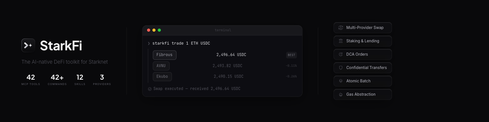

<p align="center">
  <a href="https://starkfi.app">
    
  </a>
</p>

<p align="center">
  A production-grade CLI, MCP server, and Telegram bot that gives both developers and AI agents full access to swaps, multi-swap, atomic batch transactions, staking, lending, DCA (Dollar-Cost Averaging), confidential transfers, portfolio management, and gasless transactions — all powered by the <a href="https://github.com/keep-starknet-strange/starkzap">Starkzap SDK</a>.
</p>

<p align="center">
  <a href="https://www.npmjs.com/package/starkfi"></a>
  <a href="https://www.npmjs.com/package/starkfi"></a>
</p>

```bash
npx starkfi@latest --help
```

---

## Why StarkFi?

Most DeFi tools are built for humans clicking buttons. StarkFi is built for **agents**.

- 🤖 **42 MCP tools** — Any AI assistant (Cursor, Claude, Antigravity) can execute DeFi operations autonomously
- ⚡ **Atomic Batching** — Combine swap + stake + lend + send into a single multicall transaction
- 💸 **Gas Abstraction Built-In** — Pay gas in STRK, ETH, USDC, USDT, or DAI via AVNU Paymaster, or let the developer sponsor gas entirely (gasfree mode)
- 📊 **Full Portfolio** — Unified view of balances, staking positions, and lending positions with USD values
- 🧪 **Simulate Everything** — Dry-run any transaction to estimate fees before broadcasting
- 💬 **Telegram Bot** — Chat-based DeFi via natural language, BYOAI model (OpenAI, Claude, Gemini)

---

## Architecture

```
┌───────────────────────────────────────────────────────────────────────────────────────┐
│                                     StarkFi                                           │
│                                                                                       │
│  ┌──────────┐  ┌────────────────┐  ┌────────────────┐  ┌─────────────────────────┐    │
│  │   CLI    │  │  MCP Server    │  │ Agent Skills   │  │    Telegram Bot         │    │
│  │  (42+    │  │  (42 tools)    │  │ (12 workflows) │  │  (BYOAI · Chat DeFi)    │    │

│  │ commands)│  │ stdio transport│  │ npx starkfi    │  │  OpenAI / Claude /      │    │
│  └────┬─────┘  └──────┬─────────┘  └─────┬──────────┘  │  Gemini                 │    │
│       │               │                  │             └───────────┬─────────────┘    │
│       └───────────────┼──────────────────┼─────────────────────────┘                  │
│                       ▼                  ▼                                            │
│  ┌────────────────────────────────────────────────────────────────────────────────┐   │
│  │                           Service Layer                                        │   │
│  │  ┌────────┐ ┌────────┐ ┌──────┐ ┌─────┐ ┌────────┐ ┌─────────┐ ┌──────────────┐ │   │
│  │  │  DEX   │ │Staking │ │ Vesu │ │ DCA │ │ Batch  │ │Portfolio│ │ Confidential │ │   │
│  │  │  Swap  │ │Lifecycl│ │  V2  │ │     │ │Multical│ │Dashboard│ │   Tongo Cash │ │   │
│  │  └────┬─────┘  └────┬─────┘  └───┬────┘  └───┬──┘  └────┬─────┘  └────┬─────┘  │   │
│  │       └─────────────┴────────────┴───────────┴──────────┴─────────────┘        │   │
│  │                     │                                                          │   │
│  │         ┌───────────┴───────────────────────────────┐                          │   │
│  │         │       Starkzap SDK (starkzap v2.0.0)      │                          │   │
│  │         │  Wallet · TxBuilder · Tokens · Paymaster  │                          │   │
│  │         └─────────────┬─────────────────────────────┘                          │   │
│  └───────────────────────┼────────────────────────────────────────────────────────┘   │
│                          ▼                                                            │
│  ┌──────────────────────────────────────┐  ┌──────────────────────┐                   │
│  │  Auth Server (Hono + Privy TEE)      │  │  AVNU Paymaster      │                   │
│  │  Email OTP · Wallet · Sign · Gas     │  │  Gas Abstraction     │                   │
│  └──────────────────────────────────────┘  └──────────────────────┘                   │
└───────────────────────────────────────────────────────────────────────────────────────┘
                              │
                              ▼
                    ┌──────────────────┐
                    │  Starknet (L2)   │
                    └──────────────────┘
```

---

## Starkzap Modules Used

StarkFi leverages **all core Starkzap modules**:

| Module                               | Usage in StarkFi                                                                                           |
| ------------------------------------ | ---------------------------------------------------------------------------------------------------------- |
| **Wallets**                          | `OnboardStrategy.Privy` + `argentXV050` preset for automated email-based wallet onboarding via Privy TEE   |
| **Gasless Transactions (Paymaster)** | Paymaster integration with 5 gas tokens (STRK, ETH, USDC, USDT, DAI) + developer-sponsored gasfree mode    |
| **Staking**                          | Multi-token staking lifecycle (STRK, WBTC, tBTC, SolvBTC, LBTC) — stake, claim, compound, unstake (2-step) |
| **DCA**                              | Dollar-Cost Averaging via AVNU and Ekubo — create, preview, list, and cancel recurring buy orders          |
| **TxBuilder**                        | Atomic multicall batching — combine swap + stake + supply + send + borrow + repay + withdraw + dca in one transaction  |
| **Confidential (Tongo Cash)**        | Privacy-preserving transfers via TongoConfidential — fund, transfer, withdraw, ragequit, rollover         |
| **ERC-20 Tokens**                    | Token presets, balance queries, transfers, approvals                                                       |

---

## Features

### 🔄 Token Swap (Multi-Provider)

Swap tokens on Starknet via Fibrous (default), AVNU, or Ekubo — or use `--provider auto` to race all providers for the best price. Supports multi-pair batch swaps.

```bash
npx starkfi@latest trade 100 USDC ETH                    # Swap via Fibrous (default)
npx starkfi@latest trade 100 USDC ETH --provider auto     # Race all providers for best price
npx starkfi@latest multi-swap "100 USDC>ETH, 50 USDT>ETH"
```

### 📅 Dollar-Cost Averaging (DCA)

Set up recurring buy orders that automatically swap a fixed amount at regular intervals. Supports AVNU and Ekubo DCA providers.

```bash
npx starkfi@latest dca-preview 10 USDC ETH                                     # Preview single cycle
npx starkfi@latest dca-create 1000 USDC ETH --per-cycle 10 --frequency P1D       # Daily DCA
npx starkfi@latest dca-list --status ACTIVE                                      # View orders
npx starkfi@latest dca-cancel <order_id>                                         # Cancel order
```

### 🔒 Confidential Transfers (Tongo Cash)

Privacy-preserving transfers using ZK proofs via Tongo. Amounts are hidden on-chain; recipients are identified by elliptic curve public keys.

```bash
npx starkfi@latest conf-setup --key <TONGO_KEY> --contract 0x…   # One-time setup
npx starkfi@latest conf-balance                                  # Check confidential balance
npx starkfi@latest conf-fund 100 --token USDC                    # Fund confidential account
npx starkfi@latest conf-transfer 50 --recipient-x 0x… --recipient-y 0x…  # Private transfer
npx starkfi@latest conf-withdraw 100                              # Withdraw to public balance
npx starkfi@latest conf-ragequit                                  # Emergency full withdrawal
npx starkfi@latest conf-rollover                                  # Activate pending balance
```

### ⚛️ Atomic Transaction Batching

Bundle multiple DeFi operations into a single Starknet multicall. Minimum 2 operations.

```bash
npx starkfi@latest batch \
  --swap "100 USDC ETH" \
  --stake "50 STRK karnot" \
  --supply "200 USDC Prime" \
  --send "10 STRK 0xAddr" \
  --borrow "0.5 ETH 500 USDC Prime" \
  --withdraw "200 USDC Prime"
```

### 🥩 Multi-Token Staking Lifecycle

Full staking lifecycle across multiple validators with STRK, WBTC, tBTC, SolvBTC, and LBTC support.

```bash
npx starkfi@latest stake 100 -v karnot
npx starkfi@latest rewards -v karnot --compound
npx starkfi@latest unstake intent -v karnot -a 50
npx starkfi@latest unstake exit -v karnot
```

### 🏦 Lending & Borrowing (Vesu V2)

Supply collateral, borrow assets, monitor health factors, and atomically close positions.

```bash
npx starkfi@latest lend-supply 100 -p Prime -t STRK
npx starkfi@latest lend-borrow -p Prime \
  --collateral-amount 200 --collateral-token STRK \
  --borrow-amount 50 --borrow-token USDC
npx starkfi@latest lend-status                                                # Auto-scan all pools
npx starkfi@latest lend-status -p Prime --collateral-token STRK --borrow-token USDC  # Specific position
npx starkfi@latest lend-close -p Prime --collateral-token STRK --borrow-token USDC
```

### 🩺 Lending Agent (Health Monitoring)

Real-time health factor monitoring with risk classification and automated position rebalancing.

```bash
npx starkfi@latest lend-monitor                                   # Scan all positions
npx starkfi@latest lend-monitor -p Prime --collateral-token ETH --borrow-token USDC
npx starkfi@latest lend-auto -p Prime --collateral-token ETH --borrow-token USDC
npx starkfi@latest lend-auto -p Prime --collateral-token ETH --borrow-token USDC --simulate
```

### 🌐 Network Support (Mainnet + Sepolia)

Switch between Mainnet and Sepolia instantly — no re-login required. All token addresses resolve dynamically per-network.

```bash
npx starkfi@latest config set-network sepolia   # Switch to testnet
npx starkfi@latest config set-network mainnet   # Switch back
```

| Module                | Network-Aware | Notes                                                        |
| --------------------- | ------------- | ------------------------------------------------------------ |
| **Lending (Vesu V2)** | ✅            | Pools, supply, borrow, monitor, auto-rebalance               |
| **Staking**           | ✅            | Multi-token — STRK, WBTC, tBTC, SolvBTC, LBTC                |
| **Batch**             | ✅            | All batch operations (supply, borrow, repay, withdraw, stake, send, dca) |
| **Portfolio**         | ✅            | Balances, staking positions, lending positions               |
| **Wallet (Send)**     | ✅            | Token transfers and simulation                               |
| **Swap**              | Mainnet only  | Fibrous (default), AVNU, Ekubo — selectable via `--provider` |
| **Multi-Swap**        | Mainnet only  | Per-pair provider selection                                  |
| **Rebalance**         | Mainnet only  | Uses swap routing for rebalance execution                    |

### 💸 Gas Abstraction

Users pay gas fees in their preferred ERC-20 token via AVNU Paymaster — no native STRK or ETH required. Alternatively, developers can sponsor gas entirely.

```bash
# Pay gas in USDC instead of STRK
npx starkfi@latest config set-gas-token USDC

# Developer pays all gas (gasfree mode)
npx starkfi@latest config set-gasfree on
```

| Mode                  | Who Pays  | Gas Tokens                 | Description                       |
| --------------------- | --------- | -------------------------- | --------------------------------- |
| **Gasless** (default) | User      | STRK, ETH, USDC, USDT, DAI | User pays in ERC-20 via Paymaster |
| **Gasfree**           | Developer | —                          | Developer sponsors all gas        |

### 🧪 Simulation / Dry-Run

Estimate fees and validate any transaction before broadcasting.

```bash
npx starkfi@latest trade 100 USDC ETH --simulate
# → mode: SIMULATION, estimatedFee: 0.054 STRK ($0.0024), callCount: 4
```

### 📊 Portfolio Dashboard

Consolidated view of all DeFi positions in one call.

```bash
npx starkfi@latest portfolio
# → Token Balances (USD), Staking Positions, Lending Positions, Total Value
```

### 📈 Portfolio Optimization

Rebalance your portfolio to a target allocation via automated batch swaps.

```bash
npx starkfi@latest portfolio-rebalance --target "50 ETH, 30 USDC, 20 STRK"
npx starkfi@latest portfolio-rebalance --target "60 ETH, 40 STRK" --simulate
```

---

## AI Integration (MCP)

StarkFi exposes **42 MCP tools** via stdio transport, enabling AI assistants to execute DeFi operations.

```bash
# Start the MCP server
npx starkfi@latest mcp-start
```

### Tool Categories

| Category              | Tools                                                                                                                                                                                   | Count |
| --------------------- | --------------------------------------------------------------------------------------------------------------------------------------------------------------------------------------- | ----- |
| **Auth & Config**     | `get_auth_status`, `config_action`                                                                                                                                                      | 2     |
| **Wallet**            | `get_balance`, `get_portfolio`, `deploy_account`, `send_tokens`, `get_tx_status`, `rebalance_portfolio`                                                                                 | 6     |
| **Trade**             | `get_swap_quote`, `swap_tokens`, `get_multi_swap_quote`, `multi_swap`, `batch_execute`                                                                                                  | 5     |
| **Staking**           | `list_validators`, `list_pools`, `get_staking_info`, `get_stake_status`, `stake_tokens`, `unstake_tokens`, `claim_rewards`, `compound_rewards`                                          | 8     |
| **Lending**           | `list_lending_pools`, `get_lending_position`, `supply_assets`, `withdraw_assets`, `borrow_assets`, `repay_debt`, `close_position`, `monitor_lending_position`, `auto_rebalance_lending` | 9     |
| **DCA**               | `dca_preview`, `dca_create`, `dca_list`, `dca_cancel`                                                                                                                                   | 4     |
| **Confidential**      | `confidential_setup`, `confidential_balance`, `confidential_fund`, `confidential_transfer`, `confidential_withdraw`, `confidential_ragequit`, `confidential_rollover`                   | 7     |
| **Health (Lending)**  | `lending_quote_health`                                                                                                                                                                  | 1     |

### Example — AI Agent Workflow

```
User: "Swap 100 USDC to STRK and stake half on Karnot"

Agent:
  1. get_swap_quote(amount: "100", from: "USDC", to: "STRK")   → 500 STRK
  2. swap_tokens(amount: "100", from: "USDC", to: "STRK")       → txHash: 0x...
  3. stake_tokens(amount: "250", validator: "karnot", token: "STRK") → txHash: 0x...
```

### MCP Configuration

Add to your AI assistant's MCP config (Cursor, Claude, etc.):

```json
{
	"mcpServers": {
		"starkfi": {
			"command": "npx",
			"args": ["-y", "starkfi@latest", "mcp-start"]
		}
	}
}
```

For the complete tool registry and schemas, see [MCP Documentation](https://docs.starkfi.app/docs/mcp).

---

## Agent Skills

StarkFi ships with **12 agent skills** — structured instruction sets that teach AI coding assistants how to use StarkFi without custom prompting.

| Category         | Skills                                                                              |
| ---------------- | ----------------------------------------------------------------------------------- |
| **Auth**         | `authenticate-wallet`                                                               |
| **Wallet Data**  | `balance`, `portfolio`                                                              |
| **Transactions** | `send`, `trade`, `multi-swap`, `batch`, `staking`, `lending`, `dca`, `confidential` |
| **Utility**      | `config`                                                                            |

```bash
# Install skills for your AI assistant
npx skills add ahmetenesdur/starkfi
```

See [Skills Documentation](https://docs.starkfi.app/docs/skills) for details.

---

## Quick Start

### Prerequisites

- **Node.js** v18+
- **StarkFi Auth Server** running (required for Privy email OTP and Paymaster proxy)

### 1. Authenticate

```bash
npx starkfi@latest auth login user@example.com
npx starkfi@latest auth verify user@example.com <OTP_CODE>
```

### 2. Deploy Account

```bash
npx starkfi@latest deploy
```

### 3. Check Balance

```bash
npx starkfi@latest balance
```

### 4. Start Trading

```bash
npx starkfi@latest trade 10 STRK ETH --simulate    # Preview first
npx starkfi@latest trade 10 STRK ETH               # Execute
```

---

## Command Reference

### Session & Wallet

| Command                                                   | Description                      |
| --------------------------------------------------------- | -------------------------------- |
| `auth login <email>`                                      | Start email OTP authentication   |
| `auth verify <email> <code>`                              | Complete authentication          |
| `auth logout`                                             | Terminate session                |
| `status`                                                  | Check auth status and API health |
| `address`                                                 | Display Starknet address         |
| `deploy`                                                  | Deploy smart account on-chain    |
| `balance [--token <symbol>] [--json]`                     | Query token balances             |
| `send <amount> <token> <recipient> [--simulate] [--json]` | Transfer tokens                  |
| `portfolio [--json]`                                      | Full DeFi portfolio              |

### Trading

| Command                                                                                                       | Description                 |
| ------------------------------------------------------------------------------------------------------------- | --------------------------- |
| `trade <amount> <from> <to> [--provider <fibrous\|avnu\|ekubo\|auto>] [--slippage <%>] [--simulate] [--json]` | Swap tokens (via Fibrous)   |
| `multi-swap "<pairs>" [--provider <name>] [--slippage <%>] [--simulate] [--json]`                             | Multi-pair swap (2-3 pairs) |

### DCA (Dollar-Cost Averaging)

| Command                                                                                                               | Description          |
| --------------------------------------------------------------------------------------------------------------------- | -------------------- |
| `dca-preview <amount> <sell> <buy> [--provider <avnu\|ekubo>] [--json]`                                               | Preview single cycle |
| `dca-create <amount> <sell> <buy> --per-cycle <n> [--frequency <duration>] [--provider <name>] [--simulate] [--json]` | Create DCA order     |
| `dca-list [--status <ACTIVE\|CLOSED\|INDEXING>] [--provider <name>] [--page <n>] [--json]`                            | List DCA orders      |
| `dca-cancel <order_id> [--provider <name>] [--json]`                                                                  | Cancel a DCA order   |

### Confidential Transfers (Tongo Cash)

| Command                                                                        | Description                          |
| ------------------------------------------------------------------------------ | ------------------------------------ |
| `conf-setup --key <key> --contract <address>`                                  | Configure Tongo Cash credentials     |
| `conf-balance [--json]`                                                        | Show confidential balance            |
| `conf-fund <amount> [--token <symbol>] [--simulate] [--json]`                  | Fund confidential account            |
| `conf-transfer <amount> --recipient-x <x> --recipient-y <y> [--simulate] [--json]` | Confidential transfer           |
| `conf-withdraw <amount> [--to <address>] [--token <symbol>] [--simulate] [--json]` | Withdraw to public address      |
| `conf-ragequit [--to <address>] [--json]`                                      | Emergency full withdrawal            |
| `conf-rollover [--json]`                                                       | Activate pending balance             |

### Batching (Multicall)

| Command                                                                     | Description                  |
| --------------------------------------------------------------------------- | ---------------------------- |
| `batch [--simulate] --swap "..." --stake "..." --supply "..." --send "..." --borrow "..." --repay "..." --withdraw "..." --dca-create "..." --dca-cancel "..."` | Atomic multicall (min 2 ops) |

### Staking

| Command                                                                       | Description            |
| ----------------------------------------------------------------------------- | ---------------------- |
| `validators [--json]`                                                         | List active validators |
| `pools <validator> [--json]`                                                  | Show delegation pools  |
| `stake <amount> --validator <name> [--token <symbol>] [--simulate] [--json]`  | Stake tokens           |
| `stake-status [validator] [--json]`                                           | Staking dashboard      |
| `rewards --validator <name> [--token <symbol>] <--claim\|--compound>`         | Manage rewards         |
| `unstake <intent\|exit> --validator <name> [--token <symbol>] [--amount <n>]` | Unstake (2-step)       |

### Lending (Vesu V2)

| Command                                                                                                                                     | Description                            |
| ------------------------------------------------------------------------------------------------------------------------------------------- | -------------------------------------- |
| `lend-pools [name]`                                                                                                                         | List lending pools                     |
| `lend-supply <amount> -p <pool> -t <token> [--simulate]`                                                                                    | Supply assets                          |
| `lend-withdraw <amount> -p <pool> -t <token> [--simulate]`                                                                                  | Withdraw assets                        |
| `lend-borrow -p <pool> --collateral-amount <n> --collateral-token <t> --borrow-amount <n> --borrow-token <t> [--use-supplied] [--simulate]` | Borrow                                 |
| `lend-repay <amount> -p <pool> -t <token> --collateral-token <t> [--simulate]`                                                              | Repay debt                             |
| `lend-status [-p <pool> --collateral-token <t> [--borrow-token <t>]]`                                                                       | Position status (auto-scan if no args) |
| `lend-close -p <pool> --collateral-token <t> --borrow-token <t> [--simulate]`                                                               | Close position atomically              |
| `lend-monitor [-p <pool> --collateral-token <t> --borrow-token <t>]`                                                                        | Monitor health factors                 |
| `lend-auto -p <pool> --collateral-token <t> --borrow-token <t> [--strategy <type>] [--simulate]`                                            | Auto-rebalance position                |

### Portfolio

| Command                                                                              | Description                    |
| ------------------------------------------------------------------------------------ | ------------------------------ |
| `portfolio [--json]`                                                                 | Full DeFi dashboard            |
| `portfolio-rebalance --target "<allocation>" [--slippage <%>] [--simulate] [--json]` | Rebalance to target allocation |

### Configuration

| Command                                 | Description                                                |
| --------------------------------------- | ---------------------------------------------------------- |
| `config list`                           | Show current configuration (with effective network source) |
| `config reset`                          | Reset all settings to defaults                             |
| `config set-rpc <url>`                  | Set custom RPC endpoint                                    |
| `config get-rpc`                        | Show current RPC                                           |
| `config set-network <mainnet\|sepolia>` | Switch network instantly (no re-login needed)              |
| `config set-gas-token <token\|reset>`   | Set gas payment token                                      |
| `config set-gasfree <on\|off>`          | Toggle developer-sponsored gas                             |
| `tx-status <hash>`                      | Check transaction status                                   |

---

## Auth Server

StarkFi includes a dedicated **authentication server** (`server/`) built for secure, non-custodial wallet management.

### Route Groups

| Route        | Purpose                                           |
| ------------ | ------------------------------------------------- |
| `/auth`      | Email OTP login and verification via Privy        |
| `/wallet`    | Wallet creation and address retrieval             |
| `/sign`      | Transaction signing via Privy TEE (non-custodial) |
| `/paymaster` | Paymaster proxy for gas abstraction               |

### Security

- **CORS** with configurable allowlist (`ALLOWED_ORIGINS`)
- **Secure headers** via `hono/secure-headers`
- **Body size limit** (1MB)
- **Request ID tracking** for observability
- **Graceful shutdown** (SIGTERM/SIGINT with 5s force-kill)

See [`server/README.md`](server/README.md) for setup instructions.

---

## Telegram Bot

StarkFi has a dedicated **[Telegram bot](https://github.com/ahmetenesdur/starkfi-telegram-bot)** that brings DeFi to chat. Users interact with natural language — the bot translates commands into StarkFi operations.

**BYOAI Model** — each user provides their own API key (OpenAI, Claude, or Gemini). No shared keys, no centralized billing.

| Feature           | Description                                                         |
| ----------------- | ------------------------------------------------------------------- |
| **Swap**          | Token trading via Fibrous (default), AVNU, or Ekubo                 |
| **Stake**         | Multi-token staking (STRK, WBTC, tBTC, SolvBTC, LBTC)               |
| **Lend**          | Supply, borrow, repay, withdraw, close on Vesu V2                   |
| **DCA**           | Dollar-Cost Averaging with recurring buy orders (AVNU, Ekubo)        |
| **Confidential**  | Privacy-preserving transfers via Tongo Cash (ZK proofs)              |
| **Portfolio**     | Balances with USD valuations and position health                    |
| **Batch**         | Combine swap + stake + supply + send + borrow + repay + withdraw + DCA in one transaction |
| **Gas Modes**     | Gasless (pay in ERC-20) and gasfree (developer-sponsored)           |

```bash
git clone https://github.com/ahmetenesdur/starkfi-telegram-bot.git
cd starkfi-telegram-bot
pnpm install
cp .env.example .env   # Configure TELEGRAM_BOT_TOKEN, BOT_ENCRYPTION_SECRET
pnpm dev
```

See [`starkfi-telegram-bot/`](https://github.com/ahmetenesdur/starkfi-telegram-bot) for full setup and deployment (Docker support included).

---

## Tech Stack

| Layer           | Technology                                                                                           |
| --------------- | ---------------------------------------------------------------------------------------------------- |
| **Core SDK**    | [Starkzap](https://github.com/keep-starknet-strange/starkzap) v2.0.0                                 |
| **CLI**         | [Commander.js](https://github.com/tj/commander.js) v14.0.3                                           |
| **MCP**         | [@modelcontextprotocol/sdk](https://github.com/modelcontextprotocol/sdk) v1.27.1                     |
| **Schema**      | [Zod](https://zod.dev/) v4.3.6                                                                       |
| **Auth Server** | [Hono](https://hono.dev/) v4.12.7 + [Privy TEE](https://privy.io/)                                   |
| **DEX Routing** | [Fibrous](https://fibrous.finance/) (default), [AVNU](https://avnu.fi/), [Ekubo](https://ekubo.org/) |
| **Lending**     | [Vesu](https://vesu.io/) V2 Protocol                                                                 |
| **Gas**         | [AVNU](https://avnu.fi/) Paymaster                                                                   |

---

## Error Handling

StarkFi implements a robust error handling system with a custom `StarkfiError` class and **34 specific error codes** organized by domain:

| Domain         | Error Codes                                                                                                                                                                                                                                             |
| -------------- | ------------------------------------------------------------------------------------------------------------------------------------------------------------------------------------------------------------------------------------------------------- |
| **Auth**       | `AUTH_REQUIRED`, `AUTH_FAILED`, `SESSION_EXPIRED`                                                                                                                                                                                                       |
| **Wallet**     | `WALLET_NOT_DEPLOYED`, `WALLET_NOT_FOUND`, `INSUFFICIENT_BALANCE`                                                                                                                                                                                       |
| **Network**    | `NETWORK_ERROR`, `RATE_LIMITED`, `TX_FAILED`, `TX_NOT_FOUND`, `PAYMASTER_ERROR`                                                                                                                                                                         |
| **Validation** | `INVALID_CONFIG`, `INVALID_ADDRESS`, `INVALID_AMOUNT`, `INVALID_ALLOCATION`                                                                                                                                                                             |
| **DeFi**       | `SWAP_FAILED`, `NO_ROUTE_FOUND`, `SLIPPAGE_EXCEEDED`, `PROVIDER_UNAVAILABLE`, `ALL_PROVIDERS_FAILED`, `STAKING_FAILED`, `LENDING_FAILED`, `DCA_FAILED`, `CONFIDENTIAL_FAILED`, `POOL_NOT_FOUND`, `EXIT_NOT_READY`, `VALIDATOR_NOT_FOUND`, `MONITOR_FAILED`, `REBALANCE_FAILED` |
| **Confidential** | `CONFIDENTIAL_NOT_CONFIGURED`                                                                                                                                                                                                                                              |
| **System**     | `SIMULATION_FAILED`, `BATCH_LIMIT_EXCEEDED`, `UNKNOWN`                                                                                                                                                                                                  |

All network operations include **automatic retry with exponential backoff** (500ms base, max 2 retries). Parallel operations use a **sliding-window concurrency pool** to prevent RPC rate-limiting.

### Readable Starknet Errors

Raw Starknet JSON-RPC errors (hex-encoded Cairo strings like `u256_sub Overflow`) are automatically parsed into human-readable messages (15 patterns):

| Raw Error                                | Displayed Message                                                                       |
| ---------------------------------------- | --------------------------------------------------------------------------------------- |
| `u256_sub Overflow`                      | Insufficient balance — you don't have enough tokens (including gas fees)                |
| `u256_add Overflow`                      | Amount overflow — the value is too large                                                |
| `ERC20: transfer amount exceeds balance` | Insufficient token balance for this transfer                                            |
| `ERC20: burn amount exceeds balance`     | Insufficient token balance to burn                                                      |
| `ERC20: insufficient allowance`          | Token approval required — not enough allowance for this operation                       |
| `argent/multicall-failed`                | One or more calls in the transaction failed                                             |
| `argent/invalid-signature`               | Invalid signature — try re-authenticating with: starkfi auth login                      |
| `argent/invalid-timestamp`               | Transaction expired — please retry                                                      |
| `is_valid_signature`                     | Signature validation failed — try re-authenticating                                     |
| `assert_not_zero`                        | Operation failed — a required value was zero                                            |
| `Contract not found`                     | Contract not found — the target contract does not exist on this network                 |
| `UNAUTHORIZED`                           | Unauthorized — session may have expired, try: starkfi auth login                        |
| `nonce`                                  | Transaction nonce error — please retry                                                  |
| `dusty-collateral-balance`               | Collateral amount is below the pool's minimum (dust limit). Please increase the amount. |
| `dusty-debt-balance`                     | Borrow amount is below the pool's minimum (dust limit). Please increase the amount.     |

This applies to both CLI output (`formatError`) and MCP responses (`withErrorHandling`).

---

## Development

### Setup

```bash
git clone https://github.com/ahmetenesdur/starkfi.git
cd starkfi
pnpm install
```

### Build

```bash
pnpm build           # Compile TypeScript → dist/
```

### Dev Mode

```bash
pnpm dev -- --help   # Run with tsx (hot-reload)
```

### Lint & Format

```bash
pnpm lint            # ESLint
pnpm format          # Prettier
```

### Auth Server

```bash
cd server
pnpm install
cp .env.example .env    # Configure environment
pnpm dev
```

---

## Contributing

Contributions are welcome! Here's how to get started:

1. **Fork** the repository and create a feature branch
2. **Install** dependencies: `pnpm install`
3. **Make** your changes following the existing code style (TypeScript strict mode, ESLint + Prettier)
4. **Build** and verify: `pnpm build && pnpm lint`
5. **Submit** a pull request with a clear description

For bug reports and feature requests, please [open an issue](https://github.com/ahmetenesdur/starkfi/issues).

## License

[MIT](LICENSE) — ahmetenesdur
